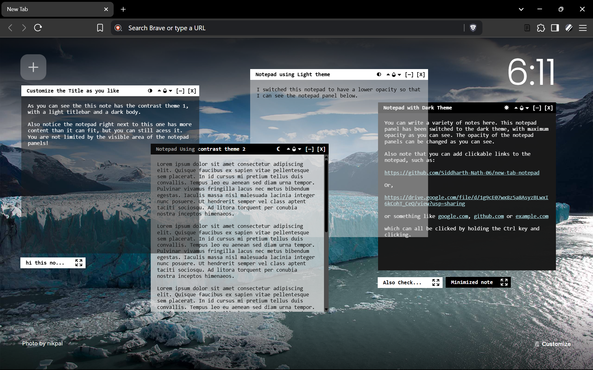

# New Tab Notepad
Persistent New Tab Notepad is a minimalist, distraction-free note-taking extension that adds persistent notepad panels in your browser's new tab page.

Built for quick jotting, daily plans, or random thoughts — each note panel stays exactly where you left it, even after you close your browser. Add, move, delete, or theme your notes with ease.

> ⚠️ Currently only works in Brave and some other chromium-based browsers with an experimental flag enabled.  **DOES NOT WORK IN GOOGLE CHROME.**

## Features
- 🗂️ **Multiple Panels** — Add as many notes as you need.
- 🧭 **Draggable Layout** — Move panels freely to organize your space.
- 🎨 **Per-Note Themes** — Choose from 4 different themes for individual notes.
- 💾 **Persistent Data** — Notes are saved locally and persist across sessions.
- 🔒 **Privacy-First** — No internet access, no tracking, no sync — everything stays on your machine.
- 🔗 **Clickable Links** — URLs in your notes are automatically clickable for easy idea gathering and quick access.

## Screenshots

## Getting Started
To Install and Use :
1. Enable the <ins>#extensions-on-chrome-urls</ins> &nbsp;in the **chrome://flags** page in a chromium browser.
2. Go to **chrome://extensions** page and enable the *Developer mode* toggle in the upper-right corner (or wherever it may be in the specific chromium browser).
3. Click the *Load Unpacked* button that appears and select the folder for the extension (either cloned from GitHub, or downloaded from Releases).
4. The extension should appear named as **Brave Notepad**. Make sure it is enabled.
5. It is recommended to pin the icon from the extensions menu in your browser for a smooth experience. On clicking the icon when in a New Tab page, you can find the options to Add Notes, Sync Themes, etc.
6. **That’s it!** Enjoy using your new Notepad — explore, experiment, and make it your own!

## Version
Version of *main* in repository: v1.0.3
 
For **Released** versions, see <a href="https://github.com/Siddharth-Nath-06/new-tab-notepad/releases">Releases</a>.

## Credits
<ins>**Icons:**</ins> &nbsp; <a href="https://www.flaticon.com/free-icons/notepad" title="notepad icons">Notepad icons created by vectorspoint - Flaticon</a>

## License
This project is Licensed under the **GNU General Public License v3.0** - see the [LICENSE.md](LICENSE.md) file for details.